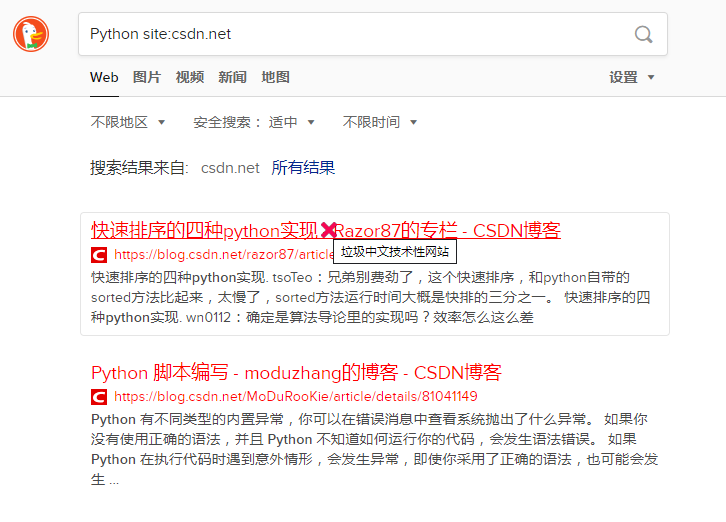

# Ban Bad Websites

 

一个屏蔽中文世界垃圾网站的浏览器用户脚本。此脚本会遍历所有的 `<a>` 标签，匹配域名和 `URL` 前缀黑名单，识别指向垃圾网站的超链接。根据用户配置，可以高亮标记/屏蔽/删除识别出的超链接。

垃圾网站黑名单类型：

- 机器翻译爬虫采集站、[内容农场](https://zh.wikipedia.org/zh-cn/%E5%85%A7%E5%AE%B9%E8%BE%B2%E5%A0%B4)、SEO 垃圾站群，例如爬 Stack Overflow 并进行机器翻译的网站
- 博彩网站，被搜索引擎搜到时看起来是正常网站，点击后进入博彩网站
- 低质量博客、下载站

本项目特色：

- 不是特定网站的针对性脚本，而是处理所有网页的所有 `<a>` 标签超链接
- 可以改变超链接外观（颜色、背景色、边框、装饰线等），让用户在点击之前就意识到，哪些链接指向垃圾网站

## 效果

默认设置：

## 安装

首先你的浏览器需要安装一个`用户脚本管理器`。如果没有安装，请查看[这个帮助页面](https://greasyfork.org/zh-CN/help/installing-user-scripts)。

进入 Greasy Fork 中[此项目的页面](https://greasyfork.org/zh-CN/scripts/389721)，点击`安装此脚本`按钮，自动弹出用户脚本管理器界面，按照提示操作即可。

## 设置

编辑源代码 `Start User Config` 和 `End User config` 之间的代码，可以启动/关闭以下功能。

- `option_highlight_link`：突出显示目标超链接，改变链接的外观、指针样式等
- `option_disable_link`：使目标超链接无法点击。不推荐，因为垃圾网站有时候还有一定参考价值，必要时可能仍然需要点击访问
- `option_remove_link`：隐藏目标超链接。不推荐，因为此脚本不是特定网站的针对性脚本，无法完美删除目标超链接，可能会导致网页显示错乱

TODO: 研究如何用方便的 GUI 进行设置，如何持久化设置。

TODO: 支持设置屏蔽网站的类型。

## 初始黑名单来源参考

- <https://www.v2ex.com/t/597368>
- <https://www.v2ex.com/t/593519>
- [Greasy Fork - 翻译垃圾再利用](https://greasyfork.org/zh-CN/scripts/389270)
- [liubiantao/uBlacklist-Websites](https://github.com/liubiantao/uBlacklist-Websites)

## 类似项目推荐

- [Greasy Fork - 翻译垃圾再利用](https://greasyfork.org/zh-CN/scripts/389270)
- [uBlacklist 扩展程序](https://chrome.google.com/webstore/detail/ublacklist/pncfbmialoiaghdehhbnbhkkgmjanfhe) + [liubiantao/uBlacklist-Websites 垃圾网站列表](https://github.com/liubiantao/uBlacklist-Websites)

## License

This project is licensed under the **GNU General Public License v3.0**
